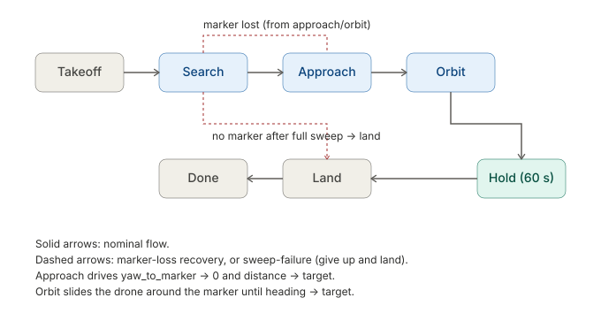

# Marker-approach mission for Parrot Anafi

A small Python application that:

1. Connects to your existing `unified_api_server.py` over HTTP.
2. Streams the drone's camera and detects an ArUco marker.
3. Recovers the marker's 6-DOF pose using OpenCV's `solvePnP` with a
   per-drone camera calibration.
4. Flies a state-machine mission: take off → search for the marker →
   approach to a configurable distance with the camera facing it
   straight on → orbit around it to a configurable relative heading →
   hover for a configurable time → land.
5. Runs an operator UI with two screens (camera view, live charts).
6. Writes the raw video, annotated video, and a per-flight CSV log to
   disk for every flight.

## Conventions and sign rules

Everything below uses the **aerospace right-hand convention**: angles
about the vertical are signed with the right-hand rule about world-up,
which means **positive = clockwise when viewed from above** (= "nose
right" for yaw).

The Anafi's gimbal keeps the camera horizontal at all times, which we
exploit so that all reported angles are in the **world horizontal
plane** and are therefore invariant to:

* drone roll and pitch (the gimbal absorbs them),
* how the marker is rotated within its own plane on the wall (upright,
  sideways, upside down — all give the same `yaw_to_marker_deg` and
  `relative_heading_deg`).

### Coordinate frames


The detector receives images in the standard OpenCV camera frame (left
panel). Because the gimbal holds the camera level, the camera's
horizontal axes (`+x_cam`, `+z_cam`) coincide with the world horizontal
plane (right panel), and world-up is exactly `−y_cam`. All horizontal
angles below are computed in this plane.

### Yaw to marker


`yaw_to_marker_deg` is the signed angle between the drone's nose
direction and the line from the drone to the marker centre, measured
in the horizontal plane.

* `yaw_to_marker_deg = 0` ⇒ marker dead ahead in the camera image.
* `yaw_to_marker_deg > 0` ⇒ marker is on the camera's right ⇒ drone
  must yaw RIGHT (CW from above, positive aerospace yaw) to face it.
* The controller commands `yaw RC = +k · yaw_to_marker_deg`.

### Relative heading around the marker


`relative_heading_deg` is the drone's compass bearing **at the marker**,
measured around world-up, with **0° = directly in front of the marker
face** and CW positive (from above).

The mission's default goal is `target_relative_heading_deg = +90°`,
i.e. **finish to the marker's own right, looking outward** (which is
the camera operator's left when standing in front of the marker).
Use `--heading -90` if you'd rather end on the other side.

To slide CW around the marker (heading 0 → +90), the drone — while
keeping the marker centred in the camera (yaw = 0) — must step to its
**own LEFT** (`lr` RC negative). The controller takes care of this
sign automatically; you should not have to think about it unless you
modify the lateral law.

### RC channels (matches the unified API server)

| channel | + sign means | drone moves                              |
|---------|--------------|------------------------------------------|
| `lr`    | right        | strafe to the drone's right              |
| `fb`    | forward      | nose-forward translation                 |
| `ud`    | up           | climb                                    |
| `yaw`   | clockwise    | yaw CW from above (aerospace nose-right) |

### Marker frame and gimbal robustness

`solvePnP` returns the marker's pose in the camera frame. The marker's
intrinsic axes (its own `+x` = "to the viewer's right when looking at
its face", `+y` up, `+z` out of the face) **rotate with the marker** if
someone hangs the marker sideways or upside-down. We avoid this by
projecting the relevant vectors onto the camera's horizontal plane (=
world horizontal plane, thanks to the gimbal) and computing all
horizontal angles there. The diagnostic field `marker_inplane_rot_deg`
tells you how the marker is rotated within its own plane, but the
control outputs (`yaw_to_marker_deg`, `relative_heading_deg`) are
invariant to that rotation.

`marker_tilt_deg` reports how far the marker plane deviates from
vertical (0° = vertical wall, ±90° = floor or ceiling). A marker on
the floor or ceiling has no horizontal-plane normal, so heading
becomes geometrically undefined; the detector returns `0` and the
operator should notice via `marker_tilt_deg ≈ ±90°`.

### Mission state machine



The mission progresses through seven phases. The marker-loss recovery
path (dashed) returns to `Search` from `Approach` or `Orbit`; if a
full search sweep does not reacquire the marker, the controller goes
straight to `Land`. See `controller.py` for the per-phase control law.

## Layout

```
marker_mission/
├── config.py              # all tuning constants in one dataclass
├── calibration_store.py   # per-serial-number camera intrinsics
├── aruco_detector.py      # detection + pose extraction
├── drone_api.py           # HTTP client and MJPEG reader
├── controller.py          # PD controllers + mission state machine
├── recorder.py            # raw/annotated video + CSV log
├── ui.py                  # two-screen Flask UI
├── mission.py             # entry point (CLI)
├── docs/figures/          # SVG diagrams used in this README
├── requirements.txt
└── README.md
```

## Install

```bash
python -m pip install -r marker_mission/requirements.txt
```

## Configure once

The first run creates `~/.marker_mission/config.json`. Edit it (or
override via `MM_*` env vars or CLI flags) to set:

* `target_marker_id`, `marker_size_m`
* `target_distance_m`, `target_relative_heading_deg`, `hold_time_s`
* PD gains and safety clamps (every tunable line is tagged `# TUNE` in
  `config.py`)
* `api_base_url` (the URL of `unified_api_server.py`)

## Calibrate each drone (one-time per unit)

1. Print a 9 × 6 inner-corner checkerboard, glue it to a flat board,
   measure one square side precisely (e.g. 25 mm).
2. With the drone on the ground (motors off), record a video of the
   board from many angles and distances. Use the **same resolution and
   stabilisation settings** you fly with. About 30–40 seconds is enough.
3. Save the file as `calib.mp4` and run:

   ```bash
   python -m marker_mission.mission calibrate \
       --video calib.mp4 \
       --serial PI040421AA1234 \
       --resolution 720p \
       --pattern 9x6 \
       --square 0.025
   ```

   Use the actual serial returned by your API server's `/api/telemetry`
   (`serial_number` field). The calibration file is saved at
   `~/.marker_mission/calibrations/anafi_<serial>_<resolution>.npz`.
   Reprojection error should be **< 0.5 px** for a good calibration.

The mission script automatically loads the right file at startup based
on the drone's serial. If no calibration is found it falls back to the
published Anafi defaults and prints a warning — the mission will still
fly, but pose accuracy will be reduced (≈ 1° / 5 cm vs. 0.3° / 2 cm).

## Fly

```bash
python -m marker_mission.mission                         # uses config defaults
python -m marker_mission.mission --distance 1.5 --hold 30
python -m marker_mission.mission --marker-id 7 --heading -90
```

The operator UI starts on `http://<host>:8080/`:

* `/`        live camera with overlay + status table
* `/charts`  live charts of distance, yaw, relative heading, telemetry

## Safety notes (READ BEFORE FLYING)

The PD gains in `config.py` are educated initial values, **not** values
verified on real hardware. Before any free flight:

1. Test with the propellers removed first. Verify each phase responds
   sensibly to manual marker movement (move the marker board around in
   front of the still drone and confirm the RC values printed in the UI
   make sense).
2. Then test in a tethered or netted environment with conservative
   `*_rc_max` clamps.
3. Watch the search behaviour: if the drone yaws and the wrong direction
   for your marker layout, flip the sign of `search_yaw_rc` or yaw the
   drone manually first.
4. Verify the angle-sign convention with a quick test: with the drone
   stationary, present the marker slightly to the camera's right and
   confirm that `yaw_to_marker_deg` reads **positive** in the UI. (See
   the "Conventions and sign rules" section above for the full picture.)
5. Verify the orbit-direction sign: on the ground, with the drone
   stationary and the marker dead ahead, manually slide the *marker*
   to the marker's own right (drone's view: left). The displayed
   `relative_heading_deg` should swing **negative** (drone is now to
   the marker's left side from the marker's POV). When you actually
   fly with `target_relative_heading_deg = +90`, the drone should slide
   to its own left while keeping the marker centred. If it slides the
   wrong way, flip the negation in `_step_orbit` / `_step_hold`'s
   `arc_err_m = -d * math.radians(e_hdg)` line.

## Per-flight artefacts

Every flight creates a directory at:

```
~/.marker_mission/flights/<YYYY-mm-dd_HH-MM-SS>_<serial>/
├── raw.mp4
├── annotated.mp4
├── flight_log.csv
└── mission_meta.json
```

`flight_log.csv` has one row per logging tick (~5 Hz) with the marker
pose (distance, yaw, relative heading), the RC commands sent, and the
drone telemetry. `mission_meta.json` records the config, calibration
source, and outcome.
