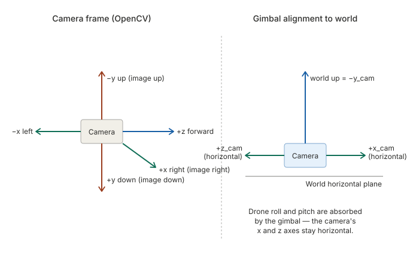
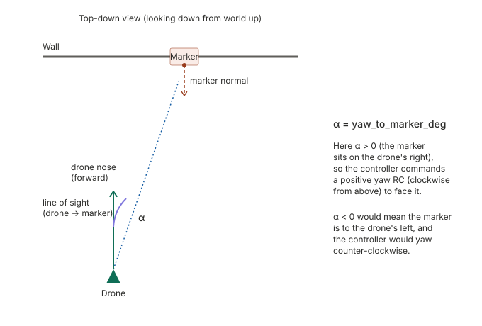
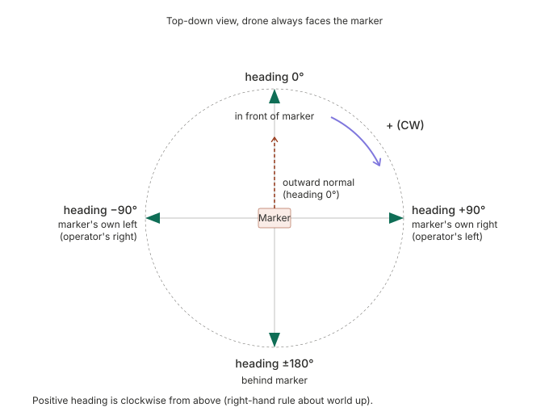

# Marker-mission control for Parrot Anafi

A small Python application that:

1. Connects to your existing `unified_api_server.py` over HTTP.
2. Streams the drone's camera and detects ArUco markers.
3. Recovers each marker's 6-DOF pose using OpenCV's IPPE planar-pose
   solver with a per-drone camera calibration.
4. Walks an **operator-typed mission script** through a phase-based
   state machine. The script language has nine commands —
   `TAKEOFF`, `APPROACH`, `HOOVER`, `AWAIT`, `PAUSE`, `HEIGHT`, `TO`,
   `DANCE`, `LAND` — and omitted arguments fall back to cfg defaults.
   The default script is `TAKEOFF / APPROACH / HOOVER / LAND`,
   equivalent to the original fixed flow.
5. Computes a **drone world position** in the arena frame by fusing
   per-marker pose estimates against an operator-defined arena layout
   (marker positions, walls, optional magnetometer offset).
6. Runs a six-screen operator UI: live camera, charts, replay
   browser, live tuning, arena editor, calibration capture.
7. Writes the raw video, annotated video, the executed mission
   script, the cfg snapshot at takeoff and landing, a parameter-change
   log, the active arena layout, the running git commit, and a
   per-tick CSV to disk for every flight.

## Mission-language and flight-phase reference

Two companion documents:

- [`MISSION_REFERENCE.md`](MISSION_REFERENCE.md) — plain-English overview
  of every script command and flight phase. Read this first.
- [`MISSION_REFERENCE_DETAILED.md`](MISSION_REFERENCE_DETAILED.md) — the
  same material with the deadbands, settle times, edge cases, recovery
  paths, and pointers into `controller.py` / `mission_script.py` filled
  in. The thing to keep open while reading the source.

## Offline tools

- [`REPROCESS_FLIGHT.md`](REPROCESS_FLIGHT.md) — re-runs the detector +
  arena estimator over a recorded flight's `raw.mp4` and produces two
  annotated comparison videos (OLD vs NEW position calc). Used to
  diagnose IPPE branch-flip incidents and to A/B the magnetometer
  offset.

## Conventions and sign rules

Everything below uses the **aerospace right-hand convention**: angles
about the vertical are signed with the right-hand rule about world-up,
which means **positive = clockwise when viewed from above** (= "nose
right" for yaw).

The Anafi's gimbal keeps the camera horizontal at all times, which we
exploit so that all reported angles are in the **world horizontal
plane** and are therefore invariant to:

* drone roll and pitch (the gimbal absorbs them),
* how the marker is rotated within its own plane on the wall (upright,
  sideways, upside down — all give the same `yaw_to_marker_deg` and
  `relative_heading_deg`).

### Coordinate frames



The detector receives images in the standard OpenCV camera frame (left
panel). Because the gimbal holds the camera level, the camera's
horizontal axes (`+x_cam`, `+z_cam`) coincide with the world horizontal
plane (right panel), and world-up is exactly `−y_cam`. All horizontal
angles below are computed in this plane.

### Arena frame

When the operator defines an arena (markers + walls) the controller
also uses an **arena-fixed** coordinate system: origin at the floor
centre, `+x` to the operator's right, `+y` toward the front wall,
`+z` up. The drone's `(x, y, z)` "world position" is in this frame.
Arena-frame yaw is signed CW from `+y` (front wall straight ahead = 0°).

### Yaw to marker



`yaw_to_marker_deg` is the signed angle between the drone's nose
direction and the line from the drone to the marker centre, measured
in the horizontal plane.

* `yaw_to_marker_deg = 0` ⇒ marker dead ahead in the camera image.
* `yaw_to_marker_deg > 0` ⇒ marker is on the camera's right ⇒ drone
  must yaw RIGHT (CW from above, positive aerospace yaw) to face it.
* The controller commands `yaw RC = +k · yaw_to_marker_deg`.

### Relative heading around the marker



`relative_heading_deg` is the drone's compass bearing **at the marker**,
measured around world-up, with **0° = directly in front of the marker
face** and CW positive (from above).

The script's `APPROACH` command always pins this setpoint to **0°**
so the drone closes the gap head-on (the detector is most reliable at
small tilt angles). HOLD inherits the same 0° setpoint via
`state.target_relative_heading_deg`. If you want a non-zero HOLD
heading, tune `cfg.target_relative_heading_deg` *between* APPROACH and
HOOVER — currently no script syntax exposes this directly.

To slide CW around the marker (heading 0 → +30), the drone — while
keeping the marker centred in the camera (yaw = 0) — must step to its
**own LEFT** (`lr` RC negative). The controller takes care of this
sign automatically; you should not have to think about it unless you
modify the lateral law.

### RC channels (matches the unified API server)

| channel | + sign means | drone moves                              |
|---------|--------------|------------------------------------------|
| `lr`    | right        | strafe to the drone's right              |
| `fb`    | forward      | nose-forward translation                 |
| `ud`    | up           | climb                                    |
| `yaw`   | clockwise    | yaw CW from above (aerospace nose-right) |

### Marker frame and gimbal robustness

The IPPE planar-pose solver returns the marker's pose in the camera
frame. The marker's intrinsic axes (its own `+x` = "to the viewer's
right when looking at its face", `+y` up, `+z` out of the face) **rotate
with the marker** if someone hangs the marker sideways or upside-down.
We avoid this by projecting the relevant vectors onto the camera's
horizontal plane (= world horizontal plane, thanks to the gimbal) and
computing all horizontal angles there. The diagnostic field
`marker_inplane_rot_deg` tells you how the marker is rotated within its
own plane, but the control outputs (`yaw_to_marker_deg`,
`relative_heading_deg`) are invariant to that rotation.

`marker_tilt_deg` reports how far the marker plane deviates from
vertical (0° = vertical wall, ±90° = floor or ceiling). A marker on
the floor or ceiling has no horizontal-plane normal, so heading
becomes geometrically undefined; the detector returns `0` and the
operator should notice via `marker_tilt_deg ≈ ±90°`.

### Mission state machine

The flight phases are: `INIT → TAKEOFF → SEARCH → HEIGHT_ALIGN → ALIGN
→ APPROACH → HOLD → IDLE → HEIGHT → GOTO → DANCE → LAND → DONE / ABORT`.
Which phases run, and in what order, depends on the operator's script
— see [`MISSION_REFERENCE.md`](MISSION_REFERENCE.md) for the
command → phase chain. The marker-loss recovery path returns to
`SEARCH` from any APPROACH-style phase; if a full sweep doesn't
reacquire the marker the script is truncated and the drone lands.

## Layout

```
marker_mission/
├── config.py                            # tuning constants + tune-page schema
├── calibration_store.py                 # per-serial-number camera intrinsics
├── aruco_detector.py                    # detection + IPPE pose extraction + overlay/mini-map drawing
├── arena.py                             # arena layout + multi-marker world-position estimator
├── drone_api.py                         # HTTP client and MJPEG reader
├── controller.py                        # PID controllers + state machine + script driver
├── mission_script.py                    # operator-typed script parser
├── recorder.py                          # raw/annotated video + CSV log + post-flight re-encode
├── replay.py                            # post-flight playback through the live UI
├── web_calibration.py                   # in-UI calibration capture
├── git_provenance.py                    # writes git_commit.txt at TAKEOFF
├── ui.py                                # six-screen Flask UI
├── mission.py                           # entry point (CLI)
├── README.md                            # stub pointing at docs/
├── tools/
│   ├── __init__.py
│   └── reprocess_flight.py              # offline re-processor (OLD vs NEW)
├── docs/
│   ├── README.md                        # this file
│   ├── MISSION_REFERENCE.md             # plain-English command + phase reference
│   ├── MISSION_REFERENCE_DETAILED.md    # detailed reference with code pointers
│   ├── REPROCESS_FLIGHT.md              # offline re-processor docs
│   └── figures/
│       ├── camera_and_world_frames.svg
│       ├── relative_heading.svg
│       ├── yaw_to_marker.svg
│       └── mission_state_machine.svg   # legacy 7-phase diagram (predates the script feature)
└── requirements.txt
```

## Install

```bash
python -m pip install -r marker_mission/requirements.txt
```

## Configure once

The first run creates `~/.marker_mission/config.json`. Edit it (or
override via `MM_*` env vars or CLI flags) to set:

* `target_marker_id`, `marker_size_m`
* `target_distance_m`, `target_relative_heading_deg`, `hold_time_s`
* PID gains, velocity feedforward (`kv`), and safety clamps (every
  tunable line is tagged `# TUNE` in `config.py`)
* `api_base_url` (the URL of `unified_api_server.py`)

Most parameters are also editable live via the **Tune** page in the UI
without restarting the mission. PD remains the default behaviour
because each axis defaults to `ki = 0`; bump the I gain via `/tune` to
opt the axis into PID control on the fly.

## Calibrate each drone (one-time per unit)

1. Print a 9 × 6 inner-corner checkerboard, glue it to a flat board,
   measure one square side precisely (e.g. 25 mm).
2. With the drone on the ground (motors off), record a video of the
   board from many angles and distances. Use the **same resolution and
   stabilisation settings** you fly with. About 30–40 seconds is enough.
3. Save the file as `calib.mp4` and run:

   ```bash
   python -m marker_mission.mission calibrate \
       --video calib.mp4 \
       --serial PI040421AA1234 \
       --resolution 720p \
       --pattern 9x6 \
       --square 0.025
   ```

   Use the actual serial returned by your API server's `/api/telemetry`
   (`serial_number` field). The calibration file is saved at
   `~/.marker_mission/calibrations/anafi_<serial>_<resolution>.npz`.
   Reprojection error should be **< 0.5 px** for a good calibration.

The mission script automatically loads the right file at startup based
on the drone's serial. If no calibration is found it falls back to the
published Anafi defaults and prints a warning — the mission will still
fly, but pose accuracy will be reduced (≈ 1° / 5 cm vs. 0.3° / 2 cm).

## Define the arena (optional, but recommended)

When the operator builds an arena layout — a list of marker IDs with
fixed `(x, y, z)` positions in the arena frame, plus the wall
dimensions — the controller can fuse multiple visible markers into a
single drone world-position estimate. This unlocks the `TO <x> <y>`
script command (drive to an arena coordinate) and the arena mini-map
overlay in the annotated video.

Open the **Arena** tab in the UI to:

* enter `width`, `depth`, `top_z`, `bottom_z`, `marker size`
* drag markers onto walls / floor / ceiling
* set the optional **magnetic north (arena yaw)** offset for IPPE
  branch disambiguation (see *Magnetometer offset* below)
* save as the active arena, or under a named slot

The active arena is persisted to
`~/.marker_mission/active_arena_config.json` and reloaded at startup.

### Magnetometer offset

The IPPE planar-pose solver returns two candidate `(R, t)` per marker,
mirrored across the marker normal. At flight-realistic conditions
(18 cm marker @ 3 m, ~56 px wide, sub-pixel corner noise) the
reproj-error gap between the two branches collapses below noise and
the picker can flip — locking in a wrong branch via temporal continuity
and tracking the geometric mirror of the intended trajectory.

The Anafi's magnetometer (`tel.yaw_deg`, drift ~1–2°/min) is an
**independent signal** that doesn't share a noise mechanism with the
reprojection-error gap. Once the operator stores the magnetic-north →
arena-`+y` offset in the arena config, the per-frame branch picker
computes both branches' implied arena yaws and picks whichever agrees
with `tel.yaw + offset`. The mirror branch implies a 20–60° yaw swing,
far above magnetometer drift, so the disambiguation is reliable from
frame 1.

**Capture procedure** (Arena tab):

1. Fly the drone to a position where ≥ 2 reference markers are
   visible and the live world-position estimate looks correct
   (the dot in the camera-page Position view sits where the drone
   actually is).
2. Press **Capture** next to the *Magnetic north (arena yaw, deg)*
   field. The button computes `offset = arena_yaw - tel.yaw`
   (wrapped to ±180°) using the live state, populates the input,
   and is enabled only when the captured fix is fresh (< 1 s),
   ≥ 2 markers contributed, and `tel.yaw` is available.
3. Press **Save active** to persist the arena. Subsequent flights
   pick this offset up automatically; new flight directories save
   the layout (including the offset) as `arena_config.json` for
   forensic replay.

If the offset isn't set, the per-marker branch picker silently falls
back to geometry-only logic and the UI flies as it always has — the
magnetometer feature is purely additive.

### IPPE branch picker layers

Five additional defensive layers run on top of the magnetometer pick;
each is toggleable from the **Tune** tab under the *IPPE branch
picker (advanced)* group, primarily for A/B diagnostics and to capture
which layers were active in a given flight log.

| Switch | Default | What it does |
|---|---|---|
| `enable_ippe_mirror_collapse` | ON | In the truly-frontal blind window (max-heading < 10° AND heading sum near zero AND similar reproj error), collapse the per-marker world-position to the midpoint of the two IPPE candidates rather than picking one. Prevents flicker at < 3° tilt. |
| `enable_ippe_arena_oob_filter` | ON | Drop a per-marker vote that lands outside the arena bounding box (plus 1 m slack). The drone can't physically be there. |
| `enable_ippe_alt_branch_swap` | ON | When the chosen branch is OOB, try the loser branch as a rescue. Recovered ~94 % of frames on the wall-incident reprocessor run. |
| `enable_ippe_prev_anchor` | **OFF** ⚠ DANGEROUS | Branch lock based on the previous frame's fix. Without a magnetometer offset this can silently propagate a wrong-branch selection through the entire flight (the wall-incident failure mode). Only enable for diagnostics or when corner noise is very low AND the first frame is confident. |
| `enable_ippe_aggregate_oob_discard` | ON | After picking, re-check the per-marker vote against arena bounds and try alt or drop the marker; after the weighted average, discard the result if it lands OOB. The sticky position then carries forward. |

The post-flight `mission_meta.json` contains an `outcome.pose_method_counts`
tally so the operator can see how often each layer fired — useful when
comparing two flights at the same arena.

## Fly

```bash
python -m marker_mission.mission                         # uses config defaults
python -m marker_mission.mission --distance 1.5 --hold 30
python -m marker_mission.mission --marker-id 7 --heading -90
```

The operator UI starts on `http://<host>:8080/`:

* `/`           live camera with overlay, mission status table, an
                arena mini-map in the upper-right of the video, the
                **mission-script editor** (textarea in INIT,
                step-by-step list with the active step highlighted
                during flight) and a Position view showing the drone
                + visible markers in the arena frame. Editor autosaves
                on every keystroke; a "Saved scripts" disclosure
                exposes named save / load.
* `/charts`     live charts of distance, yaw, relative heading,
                telemetry (drone yaw / battery / height), and RC
                commands.
* `/replay`     browse recorded flights; per-flight playback view at
                `/replay/<flight_id>` plays the recorded video synced
                with the saved CSV and shows the executed script with
                the active step highlighted, just like the live page.
                Position view replays the per-tick world position and
                visible-marker set.
* `/tune`       live PID-gain editing with named snapshots
                (save / load / overwrite / delete). Changes apply
                instantly to the running controller and are appended
                to `<flight_dir>/parameter_changes.csv`. Includes the
                IPPE branch-picker switches under
                *IPPE branch picker (advanced)*.
* `/arena`      arena layout editor: marker positions, wall
                dimensions, magnetic-north offset, named save/load.
* `/calibrate`  in-UI camera calibration capture for the connected
                drone. Records a chessboard video, runs the OpenCV
                solver, saves the per-serial NPZ. Per-camera config
                snapshots (resolution, fov, etc.) live alongside.

### Pre-flight script

The textarea on `/` is parsed at Start. Examples:

```
# Default flow (same as the legacy fixed mission)
TAKEOFF
APPROACH 4 1.0
HOOVER 5
LAND
```

```
# Visit two markers in sequence, then dance, then land
TAKEOFF
APPROACH 4 1.0
HOOVER 3
APPROACH 7 0.8
DANCE 5 wobble
LAND
```

```
# Drive to two arena coordinates with auto-yaw, then land
TAKEOFF
TO  1.5  2.0  1.5
HOOVER 4
TO -1.0  2.0  1.5  -45
LAND
```

```
# Wait for marker 9 to appear (hover up to 30 s), then chase it
TAKEOFF
AWAIT 9 30
APPROACH 9 1.0
HOOVER 5
LAND
```

See [`MISSION_REFERENCE.md`](MISSION_REFERENCE.md) for the full
command reference.

## Safety notes (READ BEFORE FLYING)

The PID gains in `config.py` are educated initial values, **not**
values verified on real hardware. The default `ki = 0` on every axis
keeps the controller behaving exactly like the older PD until you opt
an axis into integral control via `/tune`. Before any free flight:

1. Test with the propellers removed first. While the controller is in
   INIT phase it runs a *pre-flight dry-run* — the same APPROACH-style
   PIDs compute RC values you can watch on the camera page without
   anything being sent to the drone. Move the marker board around in
   front of the still drone and confirm the displayed RC values make
   sense.
2. Then test in a tethered or netted environment with conservative
   `*_rc_max` clamps.
3. Watch the search behaviour: if the drone yaws in the wrong
   direction for your marker layout, flip the sign of `search_yaw_rc`
   or yaw the drone manually first.
4. Verify the angle-sign convention with a quick test: with the drone
   stationary, present the marker slightly to the camera's right and
   confirm that `yaw_to_marker_deg` reads **positive** in the UI. (See
   the "Conventions and sign rules" section above for the full picture.)
5. Verify the orbit-direction sign: on the ground, with the drone
   stationary and the marker dead ahead, manually slide the *marker*
   to the marker's own right (drone's view: left). The displayed
   `relative_heading_deg` should swing **negative** (drone is now to
   the marker's left side from the marker's POV). With ALIGN's lateral
   law the drone slides to its own left to drive the heading back
   toward 0; if it slides the wrong way, flip the negation in
   `_step_align` / `_step_approach` / `_step_hold`'s
   `arc_err_m = -d * math.radians(e_hdg)` line.
6. **Killswitch**: a single keystroke (default `@`, configurable on
   `/tune` via `killswitch_key`) anywhere on the web UI — including
   inside text inputs — immediately calls `/api/stop` and lands the
   drone.

## Per-flight artefacts

Every flight creates a directory **at TAKEOFF** (lazy creation — runs
that never fly leave the flights folder untouched):

```
~/.marker_mission/flights/<YYYY-mm-dd_HH-MM-SS>_<serial>/
├── raw.mp4                 # raw camera frames
├── annotated.mp4           # frames with marker overlay + arena mini-map + HUD
├── flight_log.csv          # per-tick state (~5 Hz)
├── mission_script.txt      # the executing mission script (canonicalised)
├── cfg_start.json          # cfg snapshot at takeoff
├── cfg_end.json            # cfg snapshot at landing (may differ if /tune was used mid-flight)
├── parameter_changes.csv   # one row per /tune change during the flight (only if any)
├── arena_config.json       # snapshot of the active arena layout (positions + offset)
├── git_commit.txt          # marker_mission commit running at TAKEOFF
└── mission_meta.json       # calibration source + outcome (final phase, abort reason, pose_method_counts)
```

`flight_log.csv` columns include the smoothed marker pose, the marker
id and `marker_seen` flag, the active mission-step index, the world
position (`world_x` / `world_y` / `world_z` / `world_n_used` /
`world_position_age_s`) plus per-marker pose-method tags
(`target_pose_method`, `arena_pose_methods`, `arena_per_marker_world`),
the pipe-joined list of *every* detected marker each tick
(`visible_marker_ids` — distinct from contributors), the RC commands
sent, and the drone telemetry (`vgx / vgy / vgz / yaw / pitch / roll
/ battery / height_cm / flight_time_s`). The Replay browser uses
`mission_script.txt` + `mission_step_idx` to reconstruct the
step-by-step view during playback, and `visible_marker_ids` to ring
all visible markers in the Position view (older flights without that
column fall back to contributors only).

The post-flight re-encoder runs in a daemon thread after landing,
re-muxing `raw.mp4` and `annotated.mp4` to H.264 + silent AAC so the
files are accepted by WhatsApp / Telegram / etc. The originals are
preserved as `*_orig.mp4` if the re-encode succeeded, otherwise the
files are unchanged.

The runtime persists these files outside the flight directories:

```
~/.marker_mission/
├── config.json                       # cfg defaults (tune-page persistence)
├── defaults.json                     # operator-pinned default snapshot (the "Set as default" button on /tune)
├── active_mission_script.txt         # textarea draft (debounced auto-save)
├── active_arena_config.json          # the arena loaded at startup
├── snapshots/<name>.json             # named tuning snapshots
├── mission_scripts/<name>.txt        # named mission scripts
├── arenas/<name>.json                # named arena layouts
├── camera_configs/<serial>.json      # per-camera resolution / FOV / etc.
├── calibrations/anafi_<serial>_<resolution>.npz
└── flights/...                       # see above
```
